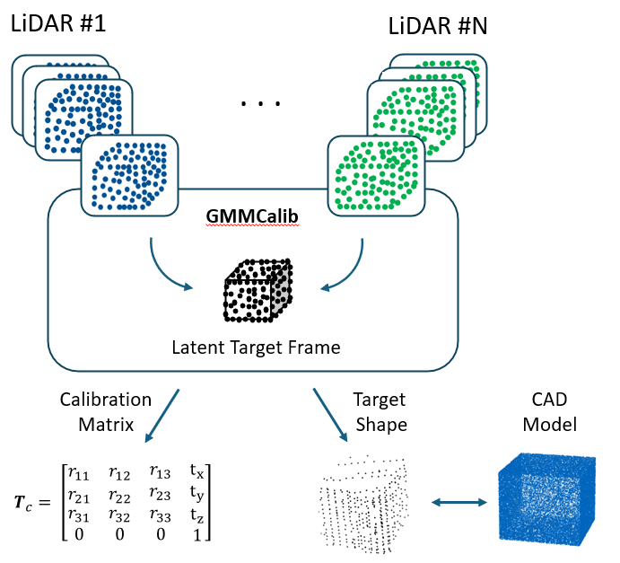

# GMMCalib
## Extrinsic Calibration of LiDAR Sensors using GMM-based Joint Registration
This is the project for the LiDAR-to-LiDAR Calibration framework GMMCalib. GMMCalib performs a joint registration of LiDAR point clouds and provides a transformation matrix between the sensors as well as the reconstructed shape of targets in the environment.

<div align="center">

</div>
 
 **Abstract:** State-of-the-art LiDAR calibration frameworks mainly use non-probabilistic registration methods such as Iterative Closest Point (ICP) and its variants. These methods suffer from biased results due to their pair-wise registration procedure as well as their sensitivity to initialization and parameterization. This often leads to misalignments in the calibration process. Probabilistic registration methods compensate for these drawbacks by specifically modeling the probabilistic nature of the observations. This paper presents GMMCalib, an automatic target-based extrinsic calibration approach for multi-LiDAR systems. Using an implementation of a Gaussian Mixture Model (GMM)-based registration method that allows joint registration of multiple point clouds, this data-driven approach is compared to ICP algorithms. We perform simulation experiments using the digital twin of the EDGAR research vehicle and validate the results in a real-world environment. We also address the local minima problem of local registration methods for extrinsic sensor calibration and use a distance-based metric to evaluate the calibration results. Our results show that an increase in robustness against sensor miscalibrations can be achieved by using GMM-based registration algorithms. 
 
Preprint: [https://arxiv.org/abs/2404.03427](https://arxiv.org/abs/2404.03427)

## Prerequisites
To begin, prepare the PCD files for each sensor, following the example provided in the `/data` directory. 
The more frames (i. e. the more pcd files) of the LiDAR scans are provided, the better the results!

## Configuration
The config file currently has four entries:
- **Initial Transformations:** If an initial alignment of your point cloud is known and desired, you can define the roll, pitch, yaw angles as well as the translation vector. This can be of use if you want to perform calibration in a common reference frame.
- **Target position:**  In case you want to use a calibration target as well as a coarse position information of the target, you can use the parameters `min_bound` and `max_bound`. If you do not have a target, you can set them to `[-50, -50, -50]` and `[50, 50, 50]` or any desired range of the point cloud.

## Use GMMCalib
A Dockerfile is provided for GMMCalib:

You can build the Docker file with a defined `<tag>`: 

    docker build -t gmmcalib:<latest> -f docker/Dockerfile .


Then run the GMM-based calibration with: 

    docker run -v $(pwd)/output:/app/output -it  gmmcalib:latest


The results, namely the calibration matrix and the numpy array of the reconstructed object, are saved in the `/output` path.

## Work in Progress (WIP)
GMMCalib is an ongoing project. Future developments include:
- Improving the usability of GMMCalib, including input data handling and configuration.
- Include routine for initial target placement.
- Enhancing the code to support an arbitrary number of LiDAR sensors.
- Implementing pre-processing steps to reduce computation effort for target-less calibration.

## Citation
```bibtex
@article{tahiraj2024gmmcalib,
  title={GMMCalib: Extrinsic Calibration of LiDAR Sensors using GMM-based Joint Registration},
  author={Tahiraj, Ilir and Fent, Felix and Hafemann, Philipp and Ye, Egon and Lienkamp, Markus},
  journal={arXiv preprint arXiv:2404.03427},
  year={2024}
}
```
