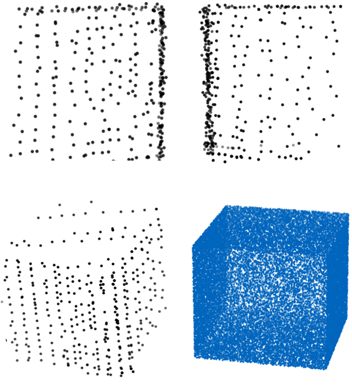

# GMMCalib
This is the project for the LiDAR-to-LiDAR Calibration framework GMMCalib. GMMCalib performs a joint registration of LiDAR point clouds and provides a transformation matrix between the sensors as well as the reconstructed shape of targets in the environment.

## Prerequisites
To begin, prepare the PCD files for each sensor, following the example provided in the `/data` directory.

## Configuration
The config file currently has four entries:
- **Initial Transformations:** If an initial alignment of your point cloud is known and desired, you can define the roll, pitch, yaw angles as well as the translation vector. This can be of use if you want to perform calibration in a common reference frame.
- **Target position:**  In case you want to use a calibration target as well as a coarse position information of the target, you can use the parameters `min_bound` and `max_bound`. If you do not have a target, you can set them to `[-50, -50, -50]` and `[50, 50, 50]` or any desired range of the point cloud.

## Use GMMCalib
A Dockerfile is provided for GMMCalib:

You can build the Docker file using: 

    docker build -t gmmcalib:<latest> -f docker/Dockerfile .

Then run the GMM-based calibration with: 

    docker run -v $(pwd)/output:/app/output -it  gmmcalib:latest

The results, namely the calibration matrix and the numpy array of the reconstructed object, are saved in the `/output` path.

## Work in Progress (WIP)
GMMCalib is an ongoing project. Future developments include:
- Improving the usability of GMMCalib, including input data handling and configuration.
- Enhancing the code to support an arbitrary number of LiDAR sensors.
- Implementing pre-processing steps to reduce computation effort for target-less calibration.

